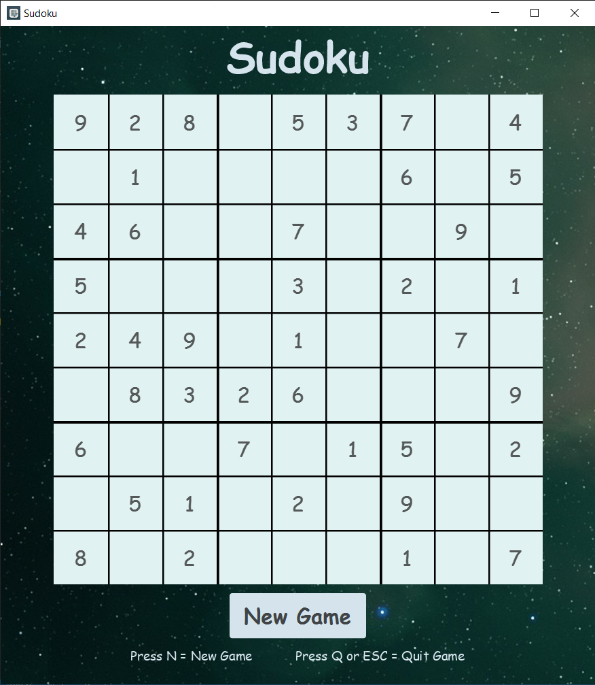

# Sudoku Game Application



This is a Sudoku game application developed in Java using JavaFX programmatically for the graphical user interface. The application was inspired by a tutorial from Ryan Micheal Kay's YouTube channel, which can be found [here](https://www.youtube.com/watch?v=JFiEYuyTgL8&t=876s).

## Table of Contents

- [Overview](#overview)
- [Changelog](#changelog)
- [Prerequisites](#prerequisites)
- [Installation](#installation)
- [Usage](#usage)
- [Features](#features)
- [Project Structure](#project-structure)

## Overview

The Sudoku Game Application is an interactive Sudoku game developed in Java using JavaFX. It features game state persistence, difficulty selection, and keyboard navigation, providing a smooth and enjoyable user experience.

## Changelog

### Latest Update

- Added the ability to navigate between editable tiles using arrow keys, improving user experience. Now the game is completely playable using only the keyboard, without the need for a mouse.

### Previous Updates

- Enhanced Sudoku game logic by adding disabled tile tracking so that when resuming a game after closing it, all the tiles that are supposed to be disabled will remain disabled, improving game state management.
- Added keyboard shortcuts for starting a new game and quitting the game, and updated the GUI to display these shortcuts.
- Added a feature to select the difficulty level when clicking the 'New Game' button to start a new game. This influences the number of empty cells in the generated puzzle.
- Updated the `SudokuSolver` class to fix a logical error in the `puzzleIsSolvable` method. The method now correctly checks if a puzzle is solvable and handles backtracking properly.

## Prerequisites

Before you begin, ensure you have met the following prerequisites:

- You have installed the latest version of Java.
- You have a Windows/Linux/Mac machine.
- You have installed JavaFX.

## Installation

To get a local copy up and running, follow these steps:

1. Clone this repository to your local machine:
   ```sh
   git clone https://github.com/yourusername/sudoku-game.git
   ```
2. Navigate to the project directory:
   ```sh
   cd sudoku-game
   ```
3. Ensure you have JavaFX installed and properly configured in your IDE.

## Usage

To run the application, execute the main method in the SudokuApplication class:

1. Open the project in your IDE.
2. Navigate to the `SudokuApplication.java` file.
3. Run the main method to start the game.

## Features

- **Game Logic**: Efficient algorithms for generating and solving Sudoku puzzles, ensuring they are challenging and fun.
- **User Interface**: Intuitive and visually appealing UI created with JavaFX, allowing smooth user interactions.
- **Game State Persistence**: Save and load game states using Java's serialization mechanism, enabling users to resume their games later.
- **Difficulty Selection**: Users can select the difficulty level when starting a new game, influencing the number of empty cells in the generated puzzle.
- **Keyboard Navigation**: Navigate between editable tiles using arrow keys, making the game fully playable using only the keyboard.
- **Disabled Tile Tracking**: Ensures that tiles with pre-filled values remain disabled when resuming a game, improving game state management.

## Project Structure

The application is divided into several packages, each responsible for a specific aspect of the game:

- **buildlogic**: Contains the `SudokuBuildLogic` class which is responsible for setting up the Sudoku game.
- **computationlogic**: Contains classes like `GameGenerator` and `SudokuSolver` which handle the logic for generating and solving Sudoku games.
- **constants**: Contains classes like `GameState` and `Rows` which define various constants used throughout the application.
- **persistence**: Contains the `LocalStorageImpl` class which handles saving and loading Sudoku games.
- **problemdomain**: Contains classes like `SudokuGame` and `Coordinates` which define the main problem domain objects.
- **userinterface**: Contains classes like `UserInterfaceImpl` and `SudokuTextField` which handle the user interface of the application.

The main entry point for the application is the `SudokuApplication` class.