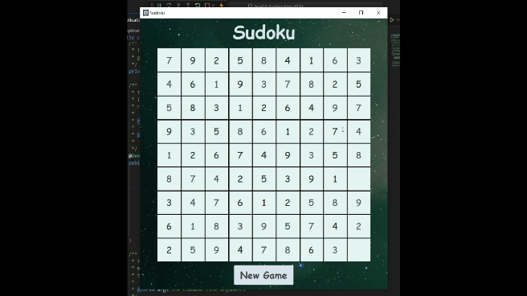

# Sudoku Game Application

This is a Sudoku game application developed in Java using JavaFX programmatically for the graphical user interface. The application was inspired by a tutorial from Ryan Micheal Kay's YouTube channel, which can be found [here](https://www.youtube.com/watch?v=JFiEYuyTgL8&t=876s).

## Updates

- The `SudokuSolver` class has been updated to fix a logical error in the `puzzleIsSolvable` method. The method now correctly checks if a puzzle is solvable and handles backtracking properly.

- Added a feature to select the difficulty level when clicking the 'New Game' button to start a new game. This influences the number of empty cells in the generated puzzle.

## Prerequisites

Before you begin, ensure you have met the following prerequisites:

- You have installed the latest version of Java.
- You have a Windows/Linux/Mac machine.
- You have installed JavaFX.

## Getting Started

To get a local copy up and running, follow these steps:

1. Clone this repository to your local machine.
2. Navigate to the project directory.
3. Run the `SudokuApplication.java` file to start the game.

## Project Structure

The application is divided into several packages, each responsible for a specific aspect of the game:

- `buildlogic`: Contains the `SudokuBuildLogic` class which is responsible for setting up the Sudoku game.
- `computationlogic`: Contains classes like `GameGenerator` and `SudokuSolver` which handle the logic for generating and solving Sudoku games.
- `constants`: Contains classes like `GameState` and `Rows` which define various constants used throughout the application.
- `persistence`: Contains the `LocalStorageImpl` class which handles saving and loading Sudoku games.
- `problemdomain`: Contains classes like `SudokuGame` and `Coordinates` which define the main problem domain objects.
- `userinterface`: Contains classes like `UserInterfaceImpl` and `SudokuTextField` which handle the user interface of the application.

The main entry point for the application is the `SudokuApplication` class.

## Running the Application

To run the application, execute the `main` method in the `SudokuApplication` class.

## Playing the Game

The game starts with a partially filled grid. The goal is to fill in the missing numbers so that each row, column, and 3x3 box contains the numbers 1 to 9 exactly once.

## Acknowledgments

- Ryan Micheal Kay for the original Sudoku game tutorial. This application was inspired by his tutorial, but includes several enhancements such as a different style, improved input handling, a new game button, and updates. Additionally, Javadocs have been added for better code documentation.